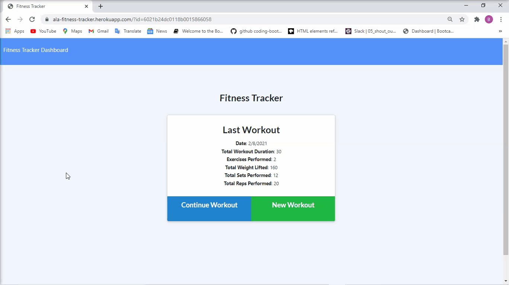

# Workout-Tracker

## Title:
Workout tracker

## Table of Contents
  * [Description](#description)
  * [Installation](#installation)
  * [Questions](#questions)
  * [License](#license)

## Description
A simple app to view, create and track daily workouts.

Here is the Github repository: https://github.com/decoste/Workout-Tracker

The Heruko deployed site: https://ala-fitness-tracker.herokuapp.com/

The following GIF demonstrates the application functionality:

## Installation
No installation needed.  Only click on the following Herohu link:

https://ala-fitness-tracker.herokuapp.com/

## Table of Contents
  * [Installation](#installation)
  * [Questions](#questions)
  * [License](#license)

## License
MIT license

## Questions
The following is my Github accounts:

-[decoste](https://github.com/decoste)

Please feel free to send us an email if you have any question(s):

aladecoste@gmail.com

## License
MIT license

Screenshots of the website:

